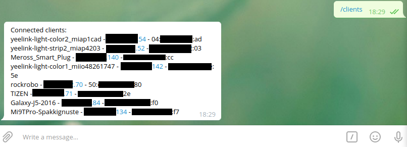

# OWBot - Openwrt Telegram Bot


````
   \      /                  #### OWbot ####  v. 0.1.0b
   _\___/_
 /______ /|  Yet another telegram bot, but for your router.
|_°_____|/   Made with <3 by Filirnd (https://github.com/filirnd/)
````

## Version
0.1.0b

This software is in beta stage, so don't use it in production environments. 

## Description
OWBot is a telegram bot for OpenWrt, made in golang and easily expandable.

It answers only to configured telegram id (only one for now) for privacy reasons.


## Functions
Actual implemented functions are:

- /clients: return list of connected clients (name - ip - mac address)   
    
    
- /reboot: reboot the router
     
Actual async implemented functions are:

- New Client trigger: when new client connects on router, the bot received a notification with same format of clients list (name - ip - mac address)


## Installation:
### Prerequisites:
For installing this bot you need of course openwrt installed. Then need to know witch kind of cpu architecture and model you have on your router. Check this for choosing right package to download.

For checking this:
```bash 
root@OpenWrt:~/owbot_install# dmesg | grep "CPU0 revision is"
[    0.000000] CPU0 revision is: 0001974c (MIPS 74Kc)
```
In this case the router have a MIPS 74Kc CPU then download the mips_74Kc.zip package for installing the bot.

Another prerequisite is create a new telegram bot from @botfather bot (follow this https://core.telegram.org/bots#3-how-do-i-create-a-bot) and get bot token.
 Get your personal telegram id too, with @GiveChatId_bot or other similar bots.

### Install:

- Unzip the correct zip package on your pc 
- Transfer the directory unziped to the /root of your router
    ```bash
        scp -r owbot_install root@192.x.y.1:/root
    ```
- Open ssh session on your router and enter on copied directory (/root/owbot_install/)

    `cd /root/owbot_install`
- Open with vi the config file /root/owbot_install/resources/config.json and change the configs like this:
    ```json  {
      "id": 0, // YOUR PERSONAL TELEGRAM ID
      "token": "00:xxxx", // YOUR BOT TOKEN
      "async" : {
          "newClient": true // SET TO true or false IF WANT NEW CLIENT TRIGGER OR NOT
      }
  }

  ```
- Launch install.sh script
    `./install.sh`
- Enjoy your bot :3


### Tested Devices
This bot is tested on this devices:
- TP-Link TL-WDR3600 v1 with OpenWrt 19.07.6 (MIPS 74Kc cpu) 

Need people for testing this bot on their routers. If you want to help me contact to email or open an issue.


## Compile
`TODO`

### Prerequisites
upx(for go package reduction) and golang installed.

`TODO`

## Add custom functions:
`TODO`


